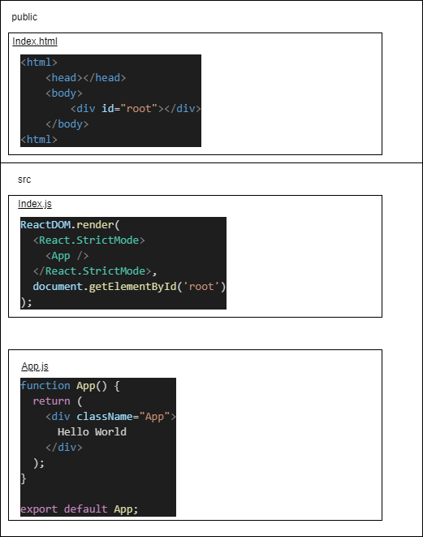

## Adding React via a CDN
```html
<!DOCTYPE html>
<html>

<head>
    <title>Test</title>
    <script src="https://unpkg.com/react@16/umd/react.development.js" crossorigin></script>
    <script src="https://unpkg.com/react-dom@16/umd/react-dom.development.js" crossorigin>
    </script>
    <script src="https://unpkg.com/babel-standalone@6/babel.min.js"></script>
</head>

<body>

    <div id="container"></div>

    <script type="text/babel">
        ReactDOM.render(
            <h1>Hello, React!</h1>,
            document.getElementById('container')
        )
    </script>
</body>

</html>
```

## Adding React via 'Create React App' tool
```
# create App
npx create-react-app myAppName
cd myAppName

# run app on http://localhost:3000
npm start

```
### App Folder Structure
| Folder/File       | Description                                                                                                                                                                                                          |
| ----------------- | -------------------------------------------------------------------------------------------------------------------------------------------------------------------------------------------------------------------- |
| public            | folder contains files related to how the application will display on the client                                                                                                                                      |
| Public/index.html | HTML template of the page                                                                                                                                                                                            |
| src               | folder contains all of the JavaScript, CSS, and image files that will be compiled into a bundle file and injected into index.html                                                                                    |
| src/index.js      | This file is the entry point into our application. In our code, a method called **ReactDOM.render()** is used to find an element with **id="root"** in the HTML and add our React application inside of that element |
| src/App.js        | This file is the main component that will be rendered to the DOM                                                                                                                                                     |



> How is React compiled into a bundle file? It uses what is called a "file loader". In the case of Create React App, **Webpack** is used.
Webpack creates a "bundle" file containing the content of multiple files that need to be "bundled" together and it is all added together into a single file. Instead of making the HTML file go and find multiple files, which can slow down load times tremendously, it only has to find one file.
create-react-app also install **Babel**, a JavaScript compliller that converts jsx to JavaScript (see [Babeljs.io](https://babeljs.io/repl))

### JSX
- ReactDOM.render(jsx, container)
- Javascript expressions are used to ease building HTML elements in Javascript
- Javascript variables can be passed in a JSX using curly braces
```jsx
cosnt name = 'David';
cosnt el = <p>Hello {name}</p>;
ReactDOM.render(el, document.getElementById('root'));
```
- Use curly braces when using jsx as attribute values
```jsx
// html
<div id="name"></div>
// jsx
<div id={user.id}></div>
```
> React DOM uses **camelCase** property Naming convention eg **class** becomes **className**

### Components
Lets you split a page into independent and reusable parts, In react you can create **Functional** or **Class** components
#### Functional Components
This is a simple JavaScript function save that it starts with an _**upper case**_ letter. To display the component, we need to create the corresponding jsx element
```jsx
function Hello(){
    return <h1>Hello World</h1>;
}

const el = <Hello />;
ReactDOM.render(el, document.getElementById('root'));
```
#### Class Components
Typically used when there are more advanced user interactions like forms and animation.
```jsx
class Hello extends React.Component{
    render(){
        return <h1>Hello World</h1>;
    }
}
```
### Props
Functional components can accept arguments, similar to JavaScript functions. These arguments are called **props**, and represent an object
```jsx
fucntion Hello(props){
    return <p>Hello {props.name}</p>;
} 

const el = <Hello name="Sesugh" />;
```
Components can also return other components
```jsx
function App(){
    return <div>
    <Hello name="Sesugh" />
    <Hello name="Paul" />
    </div>;
}
```
Props can be accessed in class components using **this.props**
```jsx
class Hello extends React.Component{
    render(){
        return <p> hello {this.props.name}</p>;
    }
}
```
### State
**state** is an object that is added as a property in a class component, this helps components change their data.
Because state should not be modified directly, react provides a **setState()** method

```jsx
//class counting appp using setState
class Counter extends React.Component{
    state = {
        counter : 0
        }

     increment = () => this.setState({counter: this.state.counter + 1});
    
    render(){
        return (
            <div>
                <p>{this.state.counter}<p>
                <button onClick ={increment}>Increment</button>
            </div>
        );
    }
}
```

### Hooks
Hooks was introduced to allow the use of state inside functional components, we need to import the **useState** named module from react.
useState returns a pair, the current state value and a function that lets you change the state
useState takes one argument which is the intial value of the state
```jsx
//function counting app using hooks
import React, {useState} from 'react';

function Counter(){
    const [counter, setCounter] = useState(0);

    increment = () => setCounter(counter + 1);
    
    return (
        <div>
            <p>{counter}<p>
            <button onClick ={increment}>Increment</button>
        </div>
    );
}
```
### Lifecycle Methods
 for class components
| Class Method         | Function Hook                                      | Description                                              |
| -------------------- | -------------------------------------------------- | -------------------------------------------------------- |
| ComponentDidMount    | `useEffect(()=>{//code})`                          | called when a component is rendered on  a page           |
| ComponentDidUpdate   | `useEffect(()=>{//code}, [count])`                 | called when a component is updated in the DOM            |
| ComponentWillUnMount | `useEffect(()=>{//code return ()=>{// cleanup};})` | called just before the component is removed from the DOM |
React provides the **useEffect** Hook to make the Lifecycle methods available in functional components

### Handling Events
React uses camelCase for event names
```jsx
function Converter() {
  const [km, setKm] = useState(0);

  function handleChange(e) {
    setKm(e.target.value);
  }
  function convert(km) {
    return (km/1.609).toFixed(2);
  }

  return <div>
        <input type="text" value={km} onChange={handleChange} />
        <p> {km} km is {convert(km)} miles </p>
  </div>;
}
```
```jsx
  // hanldling form input
    function AddForm() {
        const [sum, setSum] = useState(0);
        const [num, setNum] = useState(0);

        function handleChange(e) {
            setNum(e.target.value);
        }

        function handleSubmit(e) {
            setSum(sum + Number(num));
            e.preventDefault();
        }

        return <form onSubmit={handleSubmit}>
        <input type="number" value={num} onChange={handleChange} />
        <input type="submit" value="Add" />
        <p> Sum is {sum} </p>
        </form>;
    }
  ```
### Intro to Redux

### Adding Redux
```cmd
yarn add redux / npm install redux
yarn add react-redux / npm install react-redux
```
- under src folder create **actions** and reducers **folders**
- under src folder add a **store.js** file
- in the index.js file add the store and wrap the jsx render method input with the provider component
  ```jsx
    import {Provider} from react-redux;
    import store from ./redux/store;

    ReactDOM.render(
        <Provider store={store}>
            <React.StrictMode>
                <App />
            </React.StrictMode>
        </Provider>
        , document.getElementById('root'));

  ```
  
  